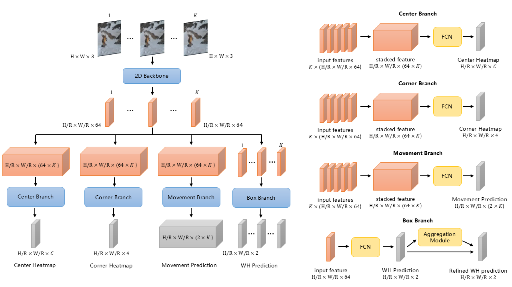
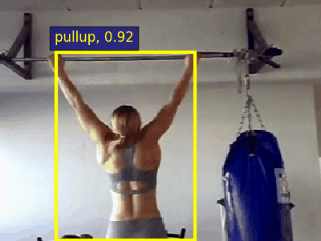
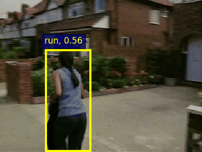
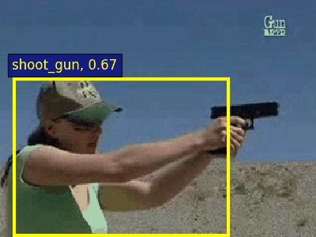
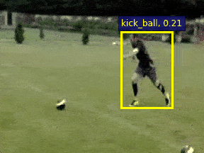

# SaccadeAction: A Fast and Accurate Action Tubelet Detector

## Overview 

​	Existing efficient algorithms for action tubelet detection focus solely on central regions of action instance and then predict the action locations. However, center keypoint maybe far from the boundary of action instance so they may fail to estimate accurate boundary on some cases. 

​	We propose a fast and accurate action tubelet detector, named SaccadeAction, which effectively attends to informative instance center and corner keypoints, and predicts action tubelets from coarse to fine. 



## Requirements

1. Create a new conda environment and activate the environment.

   ```
   conda create --name SaccadeAction python=3.8
   conda activate SaccadeAction
   ```

2. Install pytorch1.7.0.

   ```
   conda install pytorch=1.7.0 torchvision -c pytorch
   ```

   Disable cudnn batch normalization(follow [CenterNet](https://github.com/xingyizhou/pytorch-pose-hg-3d/issues/16)). You can manually open `torch/nn/functional.py` and find the line with `torch.batch_norm` and replace the `torch.backends.cudnn.enabled` with `False`.

3. Install the requirements.

   ```
   pip install -r pip-list.txt
   ```

4. Compile deformable convolutional in DLA backbone follow [CenterNet](https://github.com/xingyizhou/CenterNet/blob/master/readme/INSTALL.md).

   ```
   cd ${SaccadeAction_ROOT}/src/network/DCNv2
   bash make.sh
   ```

## Visualization










For short, run this script in `${SaccadeAction_ROOT}/src/vis`:

```
python vis_det.py --vname v_SalsaSpin_g03_c06.mp4
```

You should modify these args in `tiny_opt.py`:

```
# important args:
#
# --DATA_ROOT        path to test videos, by default is ${SaccadeAction_ROOT}/data/test_videos
# --inference_dir    path to generate result video, by default is ${SaccadeAction_ROOT}/src/vis/result_video
# --rgb_model        path to rgb model, by default is ${SaccadeAction_ROOT}/experiment/result_model/hmdb_s1_dla34_K9_rgb_coco.pth
# --flow_model        path to flow model, by default is ${SaccadeAction_ROOT}/experiment/result_model/hmdb_s1_dla34_K9_flow_coco.pth
```

You can modify these two thresholds to control visualization performance:

```
# visualization threshold:
#
# --tube_vis_th      the lowest score for retaining a tubelet, by default is 0.12 (tubelet score)
# --frame_vis_th     the lowest score for retaining a individual frame in the tubelet, by default is 0.015 (frame score)
```

Do not set a ver large `--tube_vis_th` due to the property of the focal loss, otherwise it will eliminate most of detection tubelets.

`--frame_vis_th` will eliminate the lower score detection frames from a tubelet. 

# Dataset

You can download the rgb frames , optical flow and ground truth annotations from our [Google drive](https://drive.google.com/drive/folders/1BvGywlAGrACEqRyfYbz3wzlVV3cDFkct?usp=sharing).

Please make the data folder like this:

```
${SaccadeAction_ROOT}
|-- data
`-- |-- JHMDB
    `-- |-- Frames
    `-- |-- FlowBrox04
    `-- |-- JHMDB-GT.pkl
```

# Experiment

* JHMDB

| Model                   | Backbone  | Frame-mAP@0.5 | Video-mAP@0.2 \| @0.5 \| @0.75 \| @0.5:0.95 | FPS |
| ----------------------- | --------- | ------------- | ------------------------------------------- |-----|
| ACT                     | VGG       | 65.7          | 74.2 \| 73.7 \| 52.1 \| 44.8                | 25  |
| TacNet                  | VGG       | 65.5          | 74.1 \| 73.4 \| 52.5 \| 44.8                | \-  |
| 2in1                    | VGG       | -             | \- \| 74.7 \| 53.3 \| 45.0                  | 25  |
| MOC                     | DLA34     | 70.8          | 77.3 \| 77.2 \| 71.7 \| 59.1                | 25  |
| SAMOC                   | DLA34     | 73.1          | 79.2 \| 78.3 \| 70.5 \| 58.7                | 16  |
| **SaccadeAction(Ours)** | **DLA34** | **72.6**      | **80.2 \| 80.2 \| 72.9 \| 59.6**            | 20  |

## Train

Firstly, download coco pretrained DLA-34 model from [this](https://drive.google.com/file/d/13Sf66b1cEa6ReWMljMmoie4kXA_JBT8T/view?usp=sharing).

Please move pretrained models to `${SaccadeAction_ROOT}/experiment/modelzoo`

Train RGB K=7 on JHMDB. Run:

```
python train.py --K 7 --exp_id Train_K7_rgb_coco_jhmdb_s1 --rgb_model $PATH_TO_SAVE_MODEL --batch_size 63 --master_batch 7 --lr 5e-4 --gpus 0,1,2,3,4,5,6,7 --num_workers 16 --num_epochs 20 --lr_step 6,8 --dataset hmdb --split 1

# additional scripts for jhmdb
# --dataset hmdb
# --split 1        there are 3 splits
```

Train FLOW K=7 on JHMDB. Run:

```
python train.py --K 7 --exp_id Train_K7_flow_coco_jhmdb_s1 --flow_model $PATH_TO_SAVE_MODEL --batch_size 62 --master_batch 6 --lr 5e-4 --gpus 0,1,2,3,4,5,6,7 --num_workers 16 --num_epochs 20 --lr_step 9,12 --ninput 5 --dataset hmdb --split 1
```

## Evaluate 

Firstly, we will get detection results using previous models. Please run:

```
python det.py --task normal --K 7 --gpus 0,1,2,3,4,5,6,7 --batch_size 94 --master_batch 10 --num_workers 8 --rgb_model ../experiment/result_model/$PATH_TO_RGB_MODEL --flow_model ../experiment/result_model/$PATH_TO_FLOW_MODEL --inference_dir $INFERENCE_DIR --flip_test --ninput 5

# ==============Args==============
#
# --task           during inference, there are three optional method: "normal", "stream", "speed", use "normal" by default
# --K              input tubelet length, 7 by default
# --gpus           gpu list, in our experiments, we use 8 NVIDIA TITAN XP
# --batch_size     total batch size 
# --master_batch   batch size in the first gpu
# --num_workers    total workers
# --rgb_model      path to rgb model
# --flow_model     path to flow model
# --inference_dir  path to save inference results, will be used in mAP step
# --flip_test      flip test during inference, will slightly improve performance but slow down the inference speed
# --ninput 5       stack frames, 1 for rgb, 5 for optical flow 

# additional scripts for jhmdb
# --dataset hmdb
# --split 1        there are 3 splits
# --hm_fusion_rgb  0.4 for jhmdb, 0.5 for ucf, 0.5 by default
```

After inference, you will get detection results in `$INFERENCE_DIR`.

We use the evaluation code from [ACT](https://github.com/vkalogeiton/caffe/tree/act-detector).

1. For frame mAP, please run:

   ```
   python ACT.py --task frameAP --K 7 --th 0.5 --inference_dir $INFERENCE_DIR
   ```

2. For video mAP, please build tubes first:

   ```
   python ACT.py --task BuildTubes --K 7 --inference_dir $INFERENCE_DIR
   ```

   Then, compute video mAP:

   ```
   # change --th
   python3 ACT.py --task videoAP --K 7 --th 0.2 --inference_dir $INFERENCE_DIR
   
   # 0.5:0.95
   python3 ACT.py --task videoAP_all --K 7 --inference_dir $INFERENCE_DIR 
   ```

# References

- Data augmentation codes from [ACT](https://github.com/vkalogeiton/caffe/tree/act-detector).

- Evaluation codes from  [MOC](https://github.com/MCG-NJU/MOC-Detector/tree/master).

- DLA-34 backbone codes from [CenterNet](https://github.com/xingyizhou/CenterNet).

  [ACT LICENSE](https://github.com/vkalogeiton/caffe/blob/act-detector/LICENSE)

  [CenterNet LICENSE](https://github.com/xingyizhou/CenterNet/blob/master/LICENSE)

  [MOC LICENSE](https://github.com/MCG-NJU/MOC-Detector/blob/master/LICENSE)
